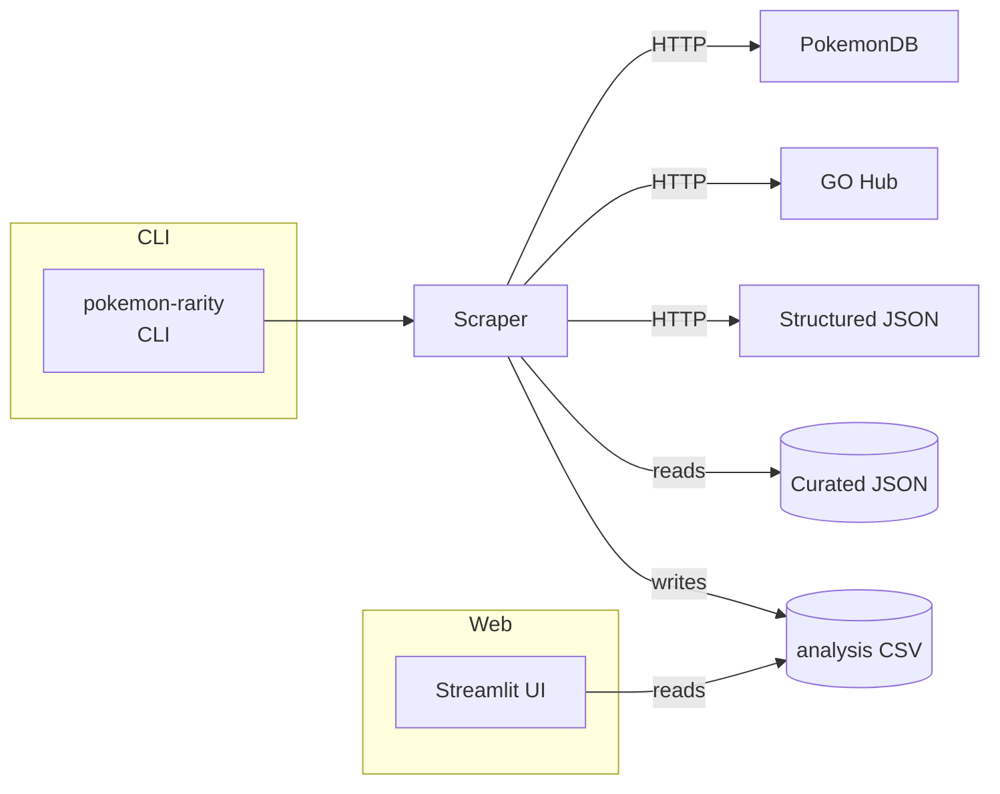

# PoGo Rarity
>
> Aggregates public Pokémon GO data sources to recommend which monsters to keep or trade.

 

## Overview

PoGo Rarity collects spawn and catch-rate information from multiple community datasets and websites, normalises the values and produces a single CSV with recommendations. A small Streamlit app lets you explore the results interactively.

## Architecture



## Quickstart

### Prerequisites

- Python ≥3.10
- Node ≥18 (for Markdown linting)
- Optional: Docker for deployment

### Setup

```bash
git clone <repo>
cd <repo>
pip install -e .
```

### Run

```bash
# scrape a small sample without writing a file
pokemon-rarity --limit 5 --dry-run

# launch the Streamlit interface on http://localhost:8501
streamlit run app.py
```

## Configuration

| Name | Type | Default | Required | Description |
|---|---|---|---|---|
| N/A | – | – | – | Configuration is handled via CLI flags (`--limit`, `--dry-run`, `--output-dir`). |

## Commands

```bash
# run tests
python -m pytest

# lint markdown files
npx markdownlint-cli README.md AGENTS.md

# build the package
python -m build
```

## Usage Examples

```bash
$ pokemon-rarity --limit 2 --dry-run
INFO - Aggregating rarity data from multiple enhanced sources...
INFO - Fetching structured spawn data...
INFO - Attempting to scrape Pokemon Database...
```

```http
GET / HTTP/1.1
Host: localhost:8501
```

The above HTTP request returns the Streamlit landing page after running `streamlit run app.py`.

## Deployment

- **Docker**: TODO create Dockerfile.
- **Kubernetes**: build an image and expose the Streamlit port 8501; mount output directory for CSVs.
- Run migrations or seeds: not applicable.

## Testing & QA

- Run `python -m pytest` for the unit test suite.
- Tests use fixtures under `tests/fixtures`.
- Coverage: TODO add coverage tooling.

## Observability

- Request logs are written to `pogorarity/pogo_debug.log`.
- Basic metrics (`requests`, `errors`, `latencies`) are available on the `EnhancedRarityScraper.metrics` dict.
- Health checks: ensure the CSV exists and Streamlit responds on `/`.

## Security & Privacy

- No authentication built in; run behind a trusted network.
- Scraper obeys polite delays and logs all outbound requests.
- Do not store PII; generated CSV contains only public game data.

## Troubleshooting

| Issue | Cause | Fix |
|---|---|---|
| ModuleNotFoundError | Dependencies missing | `pip install -e .` |
| HTTP 429 errors | Rate limiting by external sites | Re-run later; scraper backs off automatically |
| CSV not generated | `--dry-run` used or path unwritable | Remove `--dry-run` or set `--output-dir` |
| Streamlit shows blank table | CSV missing | Run scraper first |
| Tests fail to import requests | Dependencies missing | `pip install -e .` |
| Markdown lint fails | `markdownlint-cli` not installed | `npm install -g markdownlint-cli` |
| Network timeouts | External sites slow | Increase `--limit` slowly or retry |
| Permission denied writing CSV | Output directory protected | Use a writable path |
| Streamlit port in use | Another service on 8501 | `streamlit run app.py --server.port 8502` |
| CLI runs too long | Scraping full Pokédex | Use `--limit` during development |

## Contributing

1. Fork and clone the repo.
2. Create a feature branch from `main`.
3. Run tests and lint before committing.
4. Submit a pull request and mention maintainers.

See [AGENTS.md](AGENTS.md) for automation details.

## License & Support

- License: TODO
- Support: open an issue or contact `support@example.com`
