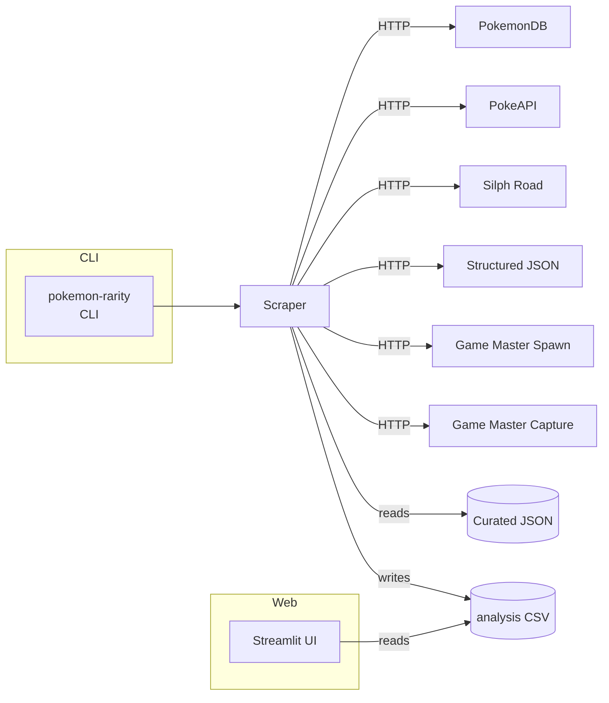

# PoGo Rarity
>
> Aggregates public Pokémon GO data sources to recommend which monsters to keep or trade.

 


## Overview

PoGo Rarity collects spawn and catch-rate information from multiple community datasets and websites, normalises the values and produces a single CSV with recommendations. A small Streamlit app lets you explore the results interactively.

## Architecture



## Scoring Model

The pipeline aggregates rarity information from seven sources:

- Structured Spawn Data
- Enhanced Curated Data
- PokemonDB Catch Rate
- PokeAPI Capture Rate
- Silph Road Spawn Tier (community reported)
- Game Master Spawn Weight
- Game Master Capture Rate

Each source's raw spawn chance or catch rate is normalised onto a 0–10
scale where 0 denotes the rarest encounters and 10 the most common. The
scores are combined using a weighted average:

- Structured Spawn Data – weight 1.0
- Enhanced Curated Data – weight 1.0
- PokemonDB Catch Rate – weight 2.0
- PokeAPI Capture Rate – weight 2.0
- Silph Road Spawn Tier – weight 0.5
- Game Master Spawn Weight – weight 1.0
- Game Master Capture Rate – weight 2.0

The resulting CSV includes `Weighted_Average_Rarity_Score` and
`Confidence` columns. Confidence indicates what fraction of the total
possible weight contributed data for a given Pokémon.

Weights can be customised by passing a JSON file to the CLI with
`--weights-file`.

### Normalisation Details

| Source | Raw Range | Mapping |
| --- | --- | --- |
| Structured Spawn Data | spawn_chance `0–20` | `score = 10 * spawn_chance / 20` |
| Enhanced Curated Data | already `0–10` | `score = value` |
| PokemonDB Catch Rate | catch rate `0–255` | `score = 10 * catch_rate / 255` |
| PokeAPI Capture Rate | capture_rate `0–255` | `score = 10 * capture_rate / 255` |
| Silph Road Spawn Tier | tier `1–5` | `score = 10 - 10 * (tier - 1) / 4` |
| Game Master Capture Rate | base_capture_rate `0–1` | `score = 10 * base_capture_rate` |
| Game Master Spawn Weight | spawnWeight `0–max` | `score = 10 * spawnWeight / max_weight` |

When no source provides a score, heuristics in
[data/infer_missing_rarity_rules.json](data/infer_missing_rarity_rules.json)
assign defaults:

- **Pseudo-legendaries** – `1.5`
- **Starters** – `6.0`
- **Very common early-route species** – `8.5`
- **Regional forms** – `4.0`

> **Note**: Silph Road spawn tier data is crowdsourced and may skew toward
> regions with more active contributors. These heuristics are coarse and may
> misclassify Pokémon with unusual availability.

The resulting `Average_Rarity_Score` feeds two threshold sets:

- Rarity bands: `<2` Very Rare, `2–4` Rare, `4–7` Uncommon, `≥7` Common.
- Trading recommendations: see Recommendation Criteria below.

### Recommendation Criteria

`get_trading_recommendation` compares a Pokémon's average score against the
configurable ``common`` and ``uncommon`` thresholds:

- score `≥ common` → **Safe to Transfer**
- ``uncommon`` ≤ score `< common` → **Depends on Circumstances**
- score `< uncommon` → **Keep or Trade Sparingly**
- spawn type `legendary` or `event-only` → **Never Transfer**
- spawn type `evolution-only` → **Evaluate for Evolution**

Threshold values live under the ``thresholds`` key in ``config.json`` and are
surfaced in the Streamlit sidebar.
The ``generation_ranges`` list can also be adjusted there to map Pokédex
numbers to game generations.

## Quickstart

### Prerequisites

- Python ≥3.10
- Node ≥18 (for Markdown linting)
- Optional: Docker for deployment

### Setup

```bash
git clone <repo>
cd <repo>
pip install -r requirements.lock
pip install -e .
```

### Run

```bash
# scrape a small sample without writing a file
pokemon-rarity --limit 5 --dry-run

# quick one-minute demo
pokemon-rarity --limit 1 --dry-run

# schema validation without writing a CSV
pokemon-rarity --limit 5 --validate-only

# customise source weighting
pokemon-rarity --weights-file weights.example.json --dry-run

# launch the Streamlit interface on http://localhost:8501
streamlit run app.py

# override thresholds, spawn type mapping and weights
cp config.example.json config.json  # edit values as desired
```

## Configuration

| Flag | Type | Default | Required | Description |
|---|---|---|---|---|
| `--limit` | int | – | No | Limit number of Pokémon scraped for testing |
| `--dry-run` | flag | false | No | Run the scraper without writing CSV output |
| `--output-dir` | str | – | No | Directory to save the CSV output file |
| `--weights-file` | str | – | No | JSON file mapping source names to weight multipliers |
| `--validate-only` | flag | false | No | Validate data without writing CSV output |

## Commands

```bash
# run tests
python -m pytest

# lint markdown files
npx markdownlint-cli README.md AGENTS.md

# build the package
python -m build
```

## Usage Examples

```bash
$ pokemon-rarity --limit 2 --dry-run
INFO - Aggregating rarity data from multiple enhanced sources...
INFO - Fetching structured spawn data...
INFO - Attempting to scrape Pokemon Database...
```

The scraper emits structured JSON logs per run in `pogorarity/run_log.jsonl` which the Streamlit UI surfaces.

```http
GET / HTTP/1.1
Host: localhost:8501
```

The above HTTP request returns the Streamlit landing page after running `streamlit run app.py`.

## Deployment

- **Docker**: Build with `docker build -t pokemon-rarity .` and run `docker run --rm pokemon-rarity --limit 1 --dry-run`.
- **Kubernetes**: build the container image and expose the Streamlit port 8501; mount output directory for CSVs.
- Run migrations or seeds: not applicable.

## Testing & QA

- Run `python -m pytest` for the unit test suite.
- Tests use fixtures under `tests/fixtures`.
- Coverage: TODO add coverage tooling.

## Observability

- Request logs are written to `pogorarity/pogo_debug.log`.
- Basic metrics (`requests`, `errors`, `latencies`) are available on the `EnhancedRarityScraper.metrics` dict.
- Run metadata with `run_id` is appended to `pogorarity/run_log.jsonl`.
- Health checks: ensure the CSV exists and Streamlit responds on `/` or query `/health`.

## Security & Privacy

- No authentication built in; run behind a trusted network.
- Scraper obeys polite delays and logs all outbound requests.
- Do not store PII; generated CSV contains only public game data.

## Troubleshooting

| Issue | Cause | Fix |
|---|---|---|
| ModuleNotFoundError | Dependencies missing | `pip install -r requirements.lock && pip install -e .` |
| HTTP 429 errors | Rate limiting by external sites | Re-run later; scraper backs off automatically |
| CSV not generated | `--dry-run` used or path unwritable | Remove `--dry-run` or set `--output-dir` |
| Streamlit shows blank table | CSV missing | Run scraper first |
| Tests fail to import requests | Dependencies missing | `pip install -r requirements.lock && pip install -e .` |
| Markdown lint fails | `markdownlint-cli` not installed | `npm install -g markdownlint-cli` |
| Network timeouts | External sites slow | Increase `--limit` slowly or retry |
| Permission denied writing CSV | Output directory protected | Use a writable path |
| Streamlit port in use | Another service on 8501 | `streamlit run app.py --server.port 8502` |
| CLI runs too long | Scraping full Pokédex | Use `--limit` during development |

## Updating dependencies

Add new packages to `pyproject.toml` and regenerate the lockfile:

```bash
make lock
```

Commit both `pyproject.toml` and `requirements.lock`. CI will fail if the lockfile is outdated.

## Contributing

1. Fork and clone the repo.
2. Install dependencies: `pip install -r requirements.lock && pip install -e .[dev]`.
3. If you change dependencies, run `make lock` to update `requirements.lock`.
4. Create a feature branch from `main`.
5. Run tests and lint before committing.
6. Submit a pull request and mention maintainers.

See [AGENTS.md](AGENTS.md) for automation details.

## License & Support

- License: [MIT](LICENSE)
- Support: open an issue
